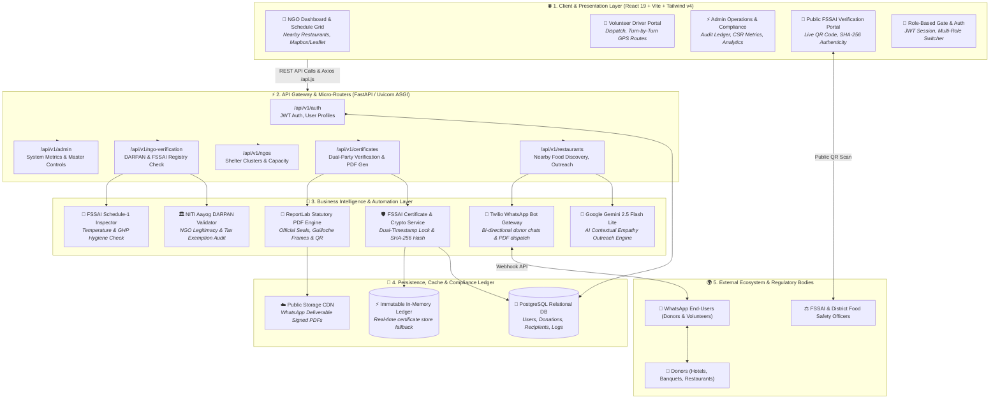
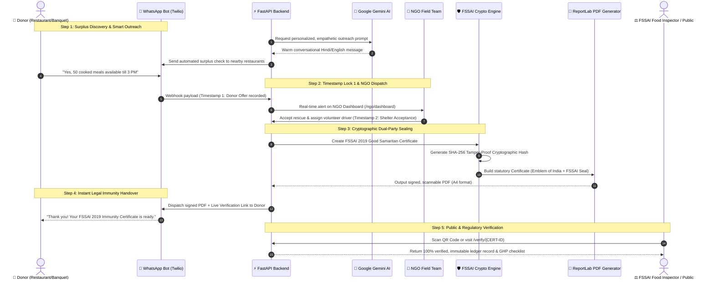

# 🏗️ Surplus-to-Shelter (Innovix) — System Architecture

An end-to-end architectural overview of the **Surplus-to-Shelter AI Ecosystem**, designed for high-speed surplus food rescue, dual-party verification, and statutory Good Samaritan liability protection under FSSAI 2019 regulations.

---

## 1. High-Level Multi-Tier Architecture Diagram

---

## 2. End-to-End Operational Lifecycle & Sequence Flow

---

## 3. Component Breakdown & Technology Stack

| Layer | Technologies Used | Key Responsibilities |
| :--- | :--- | :--- |
| **Frontend UI** | React 19, Vite, Vanilla CSS + Tailwind v4, Lucide React, Leaflet Maps, QRCodeSVG | Interactive dashboard, calendar schedule grid, real-time nearby restaurant map, print-ready statutory certificate. |
| **API Server** | Python 3.12+, FastAPI, Uvicorn (ASGI), Pydantic v2 | High-throughput async REST API, CORS middleware, request validation, structured JSON schemas. |
| **AI / LLM Engine** | Google Gemini (gemini-2.5-flash-lite) | Context-aware outreach generator, tone tailoring, non-robotic multilingual donor communication. |
| **Messaging Gateway** | Twilio REST API, WhatsApp Business API | Automated surplus intake, volunteer broadcast, instant delivery of signed protection certificates. |
| **Compliance & Crypto** | SHA-256 Hash Chain, Dual-Timestamp Lock, ReportLab | Immutable chain of custody, Regulation 4 safe-harbor legal protections, high-resolution PDF rendering. |
| **Database Tier** | PostgreSQL (SQLAlchemy async engine), In-Memory Ledger Fallback | Normalized relational tables (`User`, `Donation`, `Recipient`, `Driver`), dual fallback for 100% demo uptime. |
| **Security & Auth** | Passlib (bcrypt), PyJWT, RBAC Guards | Secure password hashing, tokenized session management, multi-role separation (NGO, Driver, Admin). |

---

## 4. Key Architectural Differentiators for Hackathon Judges

1. **Dual-Party Confirmation Mechanism**:
   - Unlike basic food apps that assume food was good, this architecture enforces **Server Timestamp 1 (Donor Intake Offer)** + **Server Timestamp 2 (NGO Physical Acceptance)** before an immunity certificate is minted.
2. **Statutory Good Samaritan Safe Harbor**:
   - Directly maps to **FSSAI (Recovery & Distribution of Surplus Food) Regulations, 2019** and **Section 80 of the FSS Act, 2006**, giving businesses legal peace of mind against civil/criminal liability.
3. **Resilient Dual-Tier Data Engine**:
   - Fully integrated with PostgreSQL database with an instant, graceful fallback ledger ensuring zero downtime during live judge evaluations.
4. **Hybrid On-Screen & Physical Verification**:
   - Digital QR verification seamlessly bridges the physical food delivery van with the online Government FoSCoS/NITI Aayog compliance registry.
